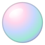
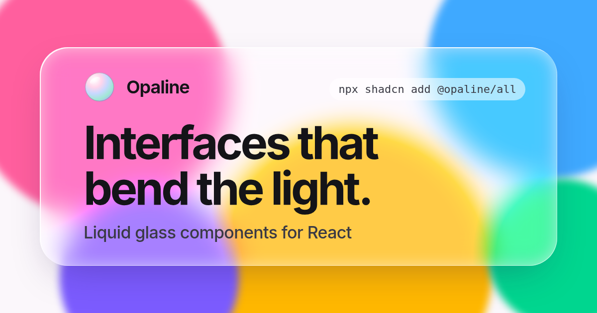

<div align="center">
  <a href="https://opaline.buildlab.in">
    
  </a>
  <h1>Opaline</h1>
  <p>Liquid glass components for React.</p>
  <p>
    <a href="https://opaline.buildlab.in">Website</a> ·
    <a href="https://opaline.buildlab.in/components">Components</a> ·
    <a href="https://opaline.buildlab.in/llms.txt">llms.txt</a> ·
    <a href=".github/CONTRIBUTING.md">Contributing</a>
  </p>
  <p>
    <a href="./LICENSE"></a>
    <a href="https://ui.shadcn.com/docs/directory"></a>
    <a href="https://github.com/deepraj21/opaline/actions/workflows/ci.yml"></a>
  </p>
</div>

<br />



Opaline is a collection of liquid glass components built on Tailwind CSS v4 and Radix UI. Surfaces bend the backdrop through real displacement maps, not just blur. You install the source with the shadcn CLI, so every component is yours to edit.

## Installation

In a project with [shadcn/ui](https://ui.shadcn.com/docs/installation) and Tailwind CSS v4 set up, add the registry to `components.json`:

```json
{
  "registries": {
    "@opaline": "https://opaline.buildlab.in/r/{name}.json"
  }
}
```

Then add the theme and any components:

```bash
npx shadcn@latest add @opaline/theme @opaline/glass-button
```

To install everything at once, run `npx shadcn@latest add @opaline/all`.

## Usage

```tsx
import { GlassButton } from "@/components/ui/glass-button"

export default function Page() {
  return <GlassButton variant="prominent">Get started</GlassButton>
}
```

Glass needs something to bend. Place components over imagery, gradients or content.

## Components

**Liquid Glass**: Badge · Button · Card · Clock · Command · Context Menu · Control Center · Date Picker · Dialog · Dock · Input · Knob · Lens · Menu · Notification · Player · Popover · Segmented · Select · Sheet · Sidebar · Slider · Stack · Stepper · Switch · Tab Bar · Tabs · Text · Toast · Toolbar · Tooltip

**Widgets**: Weather · Calendar · Battery, in iOS small, medium and large sizes

**Accents**: Activity Rings · Mesh Gradient · Rolling Number · Shimmer Text · Spinner

Every component has a live preview, source code and install commands on the [website](https://opaline.buildlab.in/components).

## Browser support

Chromium browsers (Chrome, Edge, Arc, Brave, Opera) render true refraction. Safari and Firefox fall back to frosted glass.

## Contributing

Contributions are welcome. Read the [contributing guide](.github/CONTRIBUTING.md) to get started.

## License

[MIT](./LICENSE) © Abhishek Mallick
