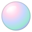
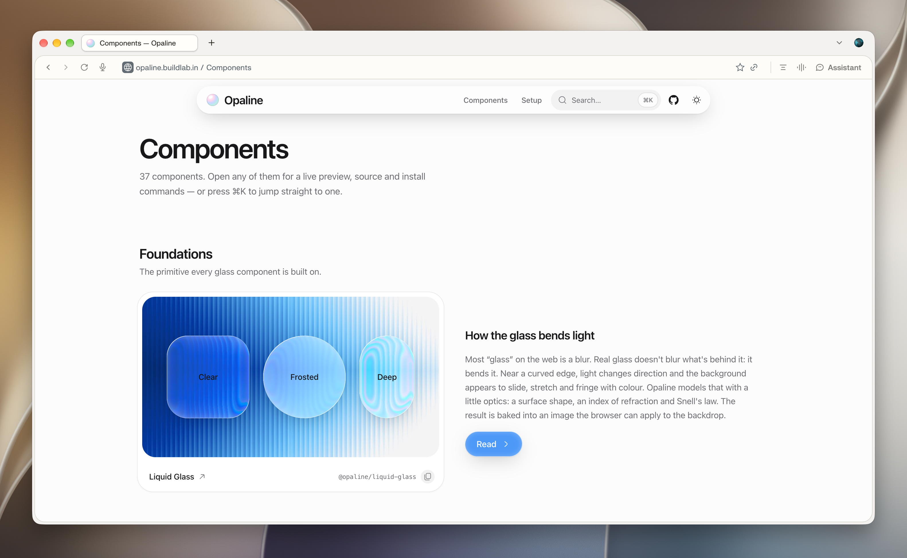

<div align="center">
  <a href="https://opaline.buildlab.in">
    
  </a>
  <h1>Opaline</h1>
  <p>Liquid glass components for React.</p>
  <p>
    <a href="https://opaline.buildlab.in">Website</a> ·
    <a href="https://opaline.buildlab.in/components">Components</a> ·
    <a href="https://opaline.buildlab.in/llms.txt">llms.txt</a> ·
    <a href="./CHANGELOG.md">Changelog</a> ·
    <a href=".github/CONTRIBUTING.md">Contributing</a>
  </p>
  <p>
    <a href="./LICENSE"></a>
    <a href="https://ui.shadcn.com/docs/directory?q=opaline"></a>
    <a href="https://github.com/deepraj21/opaline/releases"></a>
    <a href="https://github.com/deepraj21/opaline/actions/workflows/ci.yml"></a>
  </p>
</div>

<br />
<!--

-->

https://github.com/user-attachments/assets/70ddd15d-d4be-4b85-9328-3842e4bcbf8f

Opaline is a collection of liquid glass components built on Tailwind CSS v4 and Radix UI. Surfaces bend the backdrop through real displacement maps, not just blur: light is traced through the glass rim with Snell's law, using a surface profile, an index of refraction and a thickness you control. You install the source with the shadcn CLI, so every component is yours to edit.

## What's included

- **A physically based glass engine.** `LiquidGlass` traces light through the glass rim with Snell's law and refracts the backdrop through an SVG displacement map, with chromatic dispersion and a specular rim.
- **32 glass components and iOS-style widgets**, built on Radix UI with keyboard and screen-reader support.
- **Customization everywhere.** Every component page has a Customize panel with presets and copy-ready code, and a generated props table.
- **Docs for humans and agents.** An [interactive write-up](https://opaline.buildlab.in/components/liquid-glass) of the maths, plus [`llms.txt`](https://opaline.buildlab.in/llms.txt) and per-component Markdown for AI coding tools.

See the [changelog](./CHANGELOG.md) for what's new in each [release](https://github.com/deepraj21/opaline/releases).

## Installation

Opaline is listed in the [shadcn registry directory](https://ui.shadcn.com/docs/directory?q=opaline), so in any project with [shadcn/ui](https://ui.shadcn.com/docs/installation) and Tailwind CSS v4 you can install straight away:

```bash
npx shadcn@latest add @opaline/theme @opaline/glass-button
```

To install everything at once, run `npx shadcn@latest add @opaline/all`.

<details>
<summary>Using an older shadcn CLI?</summary>

Add the registry to `components.json` yourself, then run the same commands:

```json
{
  "registries": {
    "@opaline": "https://opaline.buildlab.in/r/{name}.json"
  }
}
```

Or install from a URL: `npx shadcn@latest add https://opaline.buildlab.in/r/glass-button.json`.

</details>

## Usage

```tsx
import { GlassButton } from "@/components/ui/opaline/glass-button"

export default function Page() {
  return <GlassButton variant="prominent">Get started</GlassButton>
}
```

Glass needs something to bend. Place components over imagery, gradients or content.

Tune the optics for a whole subtree with `LiquidGlassProvider`. Props set directly on a component still win:

```tsx
import { LiquidGlassProvider } from "@/components/ui/opaline/liquid-glass"

<LiquidGlassProvider ior={1.9} surface="lip" thickness={1.8} specular={0.5}>
  <App />
</LiquidGlassProvider>
```

| Prop | Default | |
| --- | --- | --- |
| `ior` | `1.5` | Index of refraction: 1.33 water, 1.5 glass, 2.42 diamond |
| `surface` | `"squircle"` | Rim profile: `squircle`, `circle`, `concave` or `lip` |
| `thickness` | `1.4` | Glass height as a multiple of the bezel width |
| `bezel` | auto | Width of the refracting rim in px |
| `dispersion` | `0.12` | Chromatic split at the rim |
| `specular` | `0.2` | Light catching the rim, from `lightAngle` (default `-60`) |
| `blur`, `saturation`, `tint`, `variant`, `shadow` | | Backdrop and surface finish |

Every component page has a **Customize** panel to try these live and copy the code, and the [Liquid Glass page](https://opaline.buildlab.in/components/liquid-glass) walks through the maths with interactive figures.

## Components

**Liquid Glass**: Badge · Button · Card · Clock · Command · Context Menu · Control Center · Date Picker · Dialog · Dock · Input · Knob · Lens · Menu · Notification · OTP Input · Player · Popover · Segmented · Select · Sheet · Sidebar · Slider · Stack · Stepper · Switch · Tab Bar · Tabs · Text · Toast · Toolbar · Tooltip

**Widgets**: Weather · Calendar · Battery, in iOS small, medium and large sizes

Every component has a live preview with a Customize panel, a props table, source code and install commands on the [website](https://opaline.buildlab.in/components).

## Browser support

Chromium browsers (Chrome, Edge, Arc, Brave, Opera) render true refraction. Safari and Firefox fall back to frosted glass.

## Contributing

Contributions are welcome, from bug reports to new components. Read the [contributing guide](.github/CONTRIBUTING.md) to set up the project and open your first pull request, and look for issues labelled [`good first issue`](https://github.com/deepraj21/opaline/labels/good%20first%20issue).

## License

[MIT](./LICENSE) © Abhishek Mallick
